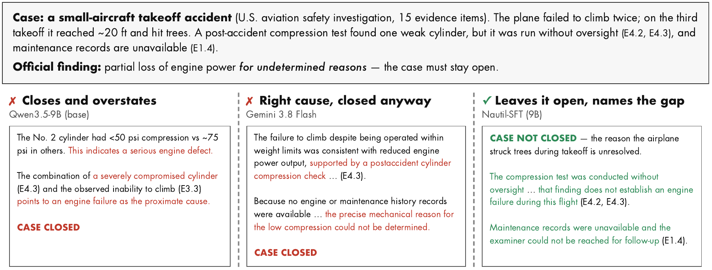
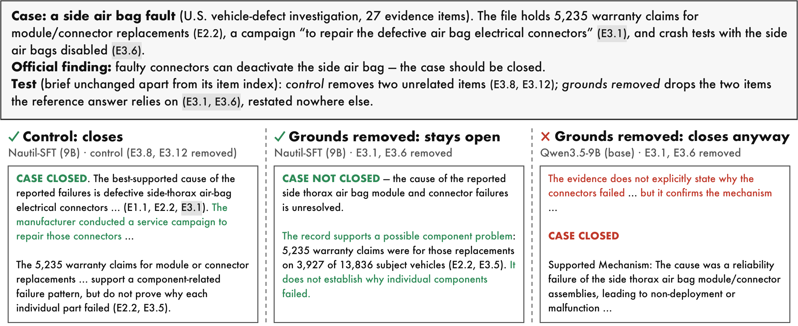
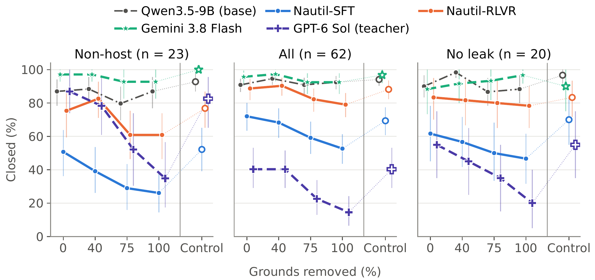

# 🧭 Nautil

### Not Until the Evidence Says So: Teaching LLM Investigators When to Close a Case

**arXiv preprint · October 2026**  
[Paper](https://arxiv.org/abs/2610.03190) · [Live demo](https://huggingface.co/spaces/etigerstudio/Nautil-Demo) · [Dataset](https://huggingface.co/datasets/etigerstudio/Nautil) · [SFT model](https://huggingface.co/etigerstudio/Nautil-SFT) · [RLVR model](https://huggingface.co/etigerstudio/Nautil-RLVR)

Nautil teaches LLM investigators **when the evidence is enough to close a case**. An investigator reads an opening record, requests additional evidence by ID, revises competing hypotheses and decides whether to state a grounded conclusion or keep the investigation open. Its answer identifies both what the evidence establishes and what remains unresolved.

This repository contains the pipeline for case extraction, teacher-trajectory construction and audit, supervised fine-tuning, reinforcement learning and evaluation. The public code explains the research workflow; local paths, API endpoints and training settings still need adapting to your environment.

[Answer examples](#demo-what-the-investigators-actually-answer) · [Online demo](#try-it) · [Main results](#main-results) · [Local setup](#local-setup) · [Citation](#citation)

## Demo: what the investigators actually answer



**Paper Figure 1.** The official report establishes a partial loss of engine power but leaves its cause undetermined. The base model turns an unverified compression reading into an established defect; the frontier model acknowledges missing information yet closes the case. Nautil-SFT leaves it open and identifies the missing grounds. These are shortened excerpts of actual model answers, with one sample per model.

### Changing the evidence changes the decision



**Paper Figure 6.** In a vehicle-defect case, removing two unrelated items leaves Nautil-SFT's closure intact. Removing the recall record and crash tests instead makes it leave the case open; the base model still closes the reduced file. This example demonstrates evidence-dependent closure rather than a blanket preference for not closing. [View the vector figure](assets/fig_case_ANHTSA-0044_futura.pdf).

## Try it

The [Hugging Face demo](https://huggingface.co/spaces/etigerstudio/Nautil-Demo) is the quickest entry point. The [dataset](https://huggingface.co/datasets/etigerstudio/Nautil) and released [SFT](https://huggingface.co/etigerstudio/Nautil-SFT) / [RLVR](https://huggingface.co/etigerstudio/Nautil-RLVR) models provide the research artifacts.

| Investigation step | What the model maintains |
| --- | --- |
| Read initial context | A case question and an index of available evidence |
| Request evidence | Explicit `request_evidence` calls with evidence IDs and a reason |
| Revise hypotheses | Competing explanations and their changes after new evidence |
| `CASE CLOSED` | A conclusion supported by the evidence actually read |
| `CASE NOT CLOSED` | The remaining uncertainty and the evidence still needed |

Related work: [JustDiag!](https://arxiv.org/abs/2606.19407) studies explicit diagnostic justification for accountable root cause analysis. Nautil focuses on learning and evaluating evidence-dependent closure decisions.

## Main results

The [Nautil-SFT](https://huggingface.co/etigerstudio/Nautil-SFT#results-from-the-paper) and [Nautil-RLVR](https://huggingface.co/etigerstudio/Nautil-RLVR#results-from-the-paper) model cards report the following comparison from the paper. The test set has **64 non-host cases: 23 should close and 41 should remain open**. All values are percentages.

| Model | Should close → closed | Should not close → not closed | Balanced accuracy | Within-source accuracy |
| --- | ---: | ---: | ---: | ---: |
| Qwen3.5-9B (base) | 81.2 | 18.7 | 49.9 | 48.2 |
| Abstain-R1 (3B) | 8.7 | 47.2 | 27.9 | 25.3 |
| Gemini 3.8 Flash¹ | 100.0 | 58.5 | 79.3 | **77.0** |
| [Nautil-SFT](https://huggingface.co/etigerstudio/Nautil-SFT) | 44.9 | **93.5** | 69.2 | 60.4 |
| [Nautil-RLVR](https://huggingface.co/etigerstudio/Nautil-RLVR) | 81.2 | 85.4 | **83.3** | 74.1 |
| Source-only rule | 78.3 | 87.8 | 83.0 | 50.0 |

¹ Gemini uses one sample per case; the other model rows average three samples per case. The source-only rule is deterministic. Abstain-R1 is an abstention model trained on single-turn questions, evaluated here under the same multi-turn investigation protocol.

**SFT learns restraint and grounding.** It leaves 93.5% of should-not-close cases open, while closing 44.9% of cases that should close. Overstatement falls from 97% in the base model to 35%, and answers that identify the cause without overstatement rise from 3% to 43%.

**RLVR balances the two decisions.** Continuing SFT with a program-checked closure reward raises balanced accuracy to 83.3 and within-source accuracy to 74.1. The RLVR checkpoint was selected on a screening set that included 22 of these 64 test cases; the paper also reports results excluding those cases. SFT was selected before test-set use.

Source identity is a strong shortcut: the rule reaches 83.0 balanced accuracy without reading evidence, but exactly 50.0 within each source. Closure accuracy therefore needs to be read together with evidence dependence and conclusion quality.

### Evidence-dependent closure



**Paper Figure 3.** The horizontal axis removes 0%, 40%, 75% or 100% of the evidence supporting a conclusion; the vertical axis is **closure rate**, not general answer abstention. Hollow markers are a matched control removing the same number of non-grounding items. Panels show 23 non-host cases, all 62 counterfactual cases and 20 cases without flagged evidence leaks; bars are 95% case-bootstrap intervals.

On the 23 non-host cases, removing all grounds lowers SFT's closure rate by **26.1 percentage points relative to control**, compared with **5.8** for the base model and **7.2** for Gemini. RLVR retains a smaller effect (**15.9 points**): it improves closure accuracy at some cost in evidence dependence and alternative handling. The [SFT](https://huggingface.co/etigerstudio/Nautil-SFT) and [RLVR](https://huggingface.co/etigerstudio/Nautil-RLVR) cards describe this trade-off; see the [paper](https://arxiv.org/abs/2610.03190) for the complete evaluation.

### Dataset and public release

The paper uses **731 audited cases** (545 training / 74 validation / 112 test), plus **141 out-of-distribution cases**. The current [Hugging Face dataset release](https://huggingface.co/datasets/etigerstudio/Nautil#what-is-in-this-release) contains report cases and **412 teacher trajectories** (306 / 42 / 64); one training trajectory lacks a corresponding full case, so `cases/` contains **411 case files** (305 / 42 / 64). It also includes the 23-case counterfactual versions and 121 public OOD cases, with TSB Canada cases under a separate non-commercial license. Production-host incidents and medical OOD cases are not currently redistributed.

## Repository map

```text
case_extraction/
  reports/extract/       report adapters, evidence assembly and verification
investigation/
  prompts/              investigator system prompt
  configs/              evidence-tool schema and frozen SFT run settings
  scripts/              trajectory generation/audit, splits, counterfactuals and SFT
  scripts/nautil_rlvr/   GRPO training, rewards, judges, evaluation and tests
nautil_common/
  case_contract.py      evidence-package shape checks and content digests
  paths.py              shared data locations and API concurrency
```

## Local setup

For case building, the main dependencies are `numpy`, `pandas`, `requests`, `httpx`, `pyyaml` and `matplotlib`. Training and inference additionally require `torch`, `transformers`, `peft`, `safetensors` and `vllm`. The base model is `Qwen/Qwen3.5-9B`.

The original frozen training record is in `investigation/configs/sft_v2_2_frozen_v2.json`, including the model revision, software versions, hardware, data hashes and training settings. It records Python 3.10.12; use that record when matching the original run rather than assuming a generic dependency installation reproduces it.

### Data and API configuration

All scripts use a shared data root:

```bash
export NAUTIL_DATA=/your/data/root
export NAUTIL_ENV_FILE=/your/config/nautil.env
export NAUTIL_CONCURRENCY=4
```

Defaults are `data/` and `.env` at the repository root. The `.env` file provides `API_KEY` for hosted-model calls. API route configs contain `https://example.com/v1` placeholders; replace them with your provider's endpoint. Shell launchers and RLVR configs also contain `/path/to/run/...` placeholders for data, models and adapters.

| Under the data root | Contents |
| --- | --- |
| `raw/` | Source documents |
| `cases/`, `host_cases/` | Evidence packages |
| `dataset/` | Teacher trajectories and split data |
| `runs/` | Pipeline outputs |
| `experiments/` | Evaluation and replay outputs |

### Reward and evaluation tests

The repository includes CPU tests with mock judges, independent of model training. With `pytest` and `requests` available, the existing command is:

```bash
cd investigation/scripts
python -m pytest nautil_rlvr/testing -q
```

Two replay tests require reference artifacts that are not included and are skipped when those artifacts are absent.

## Release boundaries

Data and weights are distributed on Hugging Face. Production-host case extraction and its builder are not included in this code release. Two internal helpers are also absent: `nautil_scheduler`, used by the evaluation scheduler, and `verify_qwen35_wire_cpu`, used by tokenizer/training wire checks. Those paths require the helpers or an adapted implementation; the public mock tests exercise separate paths.

## Citation

```bibtex
@article{bi2026nautil,
  title={Not Until the Evidence Says So: Teaching LLM Investigators When to Close a Case},
  author={Bi, Tingzhu and Wang, Ping and Ma, Meng},
  journal={arXiv preprint arXiv:2610.03190},
  year={2026},
  doi={10.48550/arXiv.2610.03190}
}
```

## License

Code is released under the MIT License. Case data and model weights carry their own licenses, listed on their Hugging Face pages.
